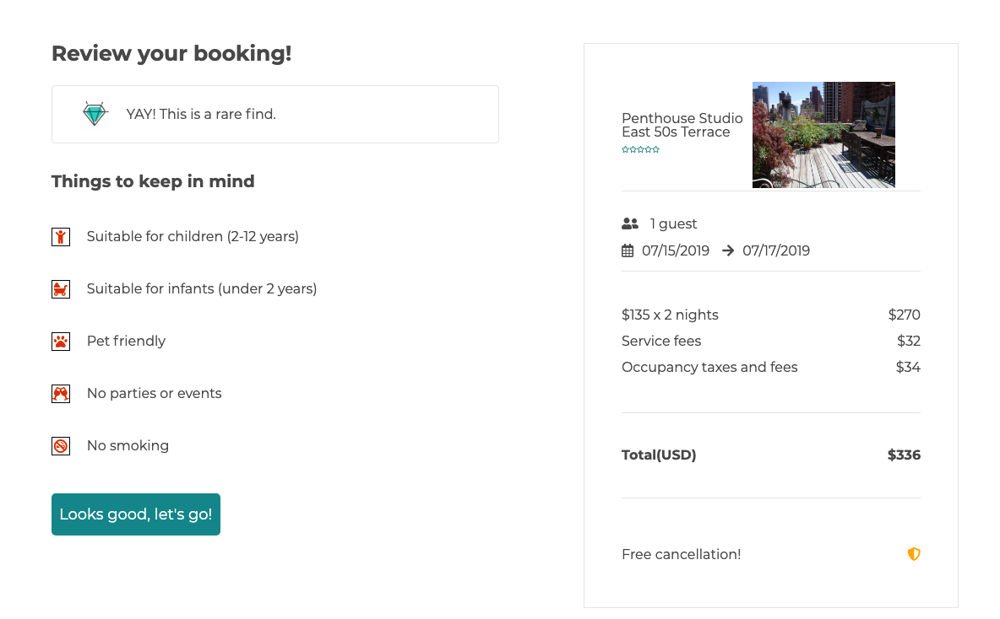

# Airbmb

[Live Site](http://air-bmb.herokuapp.com/)

Airbmb is a full stack Airbnb clone application built up in 10 days.

## Technologies

### Backend:

- ruby
- rails
- Postgresql
- AWS

### Frontend

- JavaScript
- React
- Redux

### APIs

- React Dates
- Google Map API
- Moment.js

## Key features:

- User authentication with BCrypt - including signin, login, signout. User will be able to swap between sign up and sign modal. Search form for desired dates and location.


---

- Show pages shows the listings of the pages with brief information.
- User will be able to search from this page too.


---

- Show page shows the detailed information on a specific spot.
- React-date implemented - user will be able to pick a date on calendar.
- Picutre stands out when hover over.


---

- Google Map API updates based on user search
- Filtering spots when moving map around.


---

- Review pages show all the detailed booking information.
- After user's confirmation, send info to the backend and blocked on the calendar.
  

```
  isInvalid(start, end, dates) {
    if (start && end) {
      start = moment(start);
      end = moment(end);
      while (start <= end) {
        for (let i = 0; i < dates.length; i++) {
          if (dates[i]._i === start.format("YYYY-MM-DD")) {
            return true;
          }
        }
        start = start.add(1, "days");
      }
    }
    return false;
  }

  isBlocked(day1) {
    return this.props.blockedDates.some(day2 => {
      return isSameDay(day1, day2);
    });
  }
```

---
